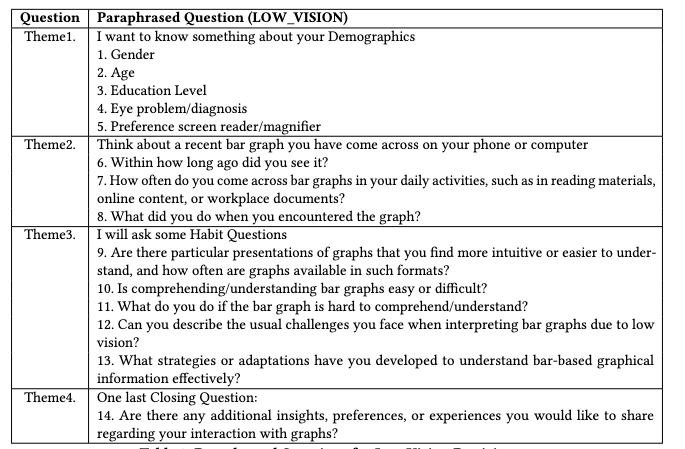

# Exit Interview 

### At the end of the user study we conducted a semi-structured interview comprising of 14 questions  This interview was conducted to understand their general preferences and difficulties with graph comprehension, collect information about any bar charts they had recently encountered, and gather demographic data to better characterize our study group. By further asking participants to detail a recently viewed bar chart, we intended to obtain more insights into their chart-reading habits, such as how often they view such charts and the typical tasks they undertake to comprehend charts using screen magnifiers. The combination of insights from the participants’ think-aloud analyses, experimenter notes, and our subsequent queries enabled us to pinpoint the unique challenges faced by low-vision individuals when interpreting charts. 

 

## Paraphrased questions for low-vision participants

## Analysis 

The exit interview comprised 14 questions. The first 5 were related to participant demographics, whereas Q6 to Q14 captured their experience with graphs.

**Q6:** 90\% of the participants recalled encountering a graph on their mobile device or computer within the past month. 
**Q7:**  50\% participants reported a frequent need to interpret graphical data in their daily lives. The most common scenarios included viewing sports statistics and graphs on trading platforms. 
**Q8:**  60\% participants tried to determine specific values in the graph and also recognize patterns in data changes. 
**Q9:** On average, participants rated the difficulty of reading pie charts as 2.5 and that of bar charts as 4.2 on a 5-point Likert scale, where 1 represents ''Very Easy'' and 5 represents ''Very Hard''. 
**Q10:** Over 60\% participants reported that understanding significant differences in bar graphs is easy, while accurately determining the exact values of each candidate is challenging. 
**Q11:** While few participants (30\%) mentioned avoiding bar graphs due to the increased effort required for comprehension, the majority of participants used assistive technologies (screen magnifier) and personalized coping strategies to understand graph information. 
**Q12:** The most prevalent complaints among participants included: ''Can’t view all parts of the graphs clearly to compare and determine the values'' (80\%), Presence of multiple distractors (40\%), Lack of color contrasts (60\%), Non-filled bars with excessive white space (60\%), and Arrangement of bars such as alignment and stack (40\%). 
**Q13:** Participants employed several strategies including: Zooming and Panning(90\%), Reading descriptions and inferences provided (70\%), and Usage of Dark modes to address white space issues(40\%).  It was noteworthy that users often combined multiple strategies based on their requirements. 
**Q14:** Participants expressed a need for increased interactivity in graphs, particularly through features like tooltips that could enhance usability. Furthermore, incorporating color contrasts to emphasize significant differences among candidates can help improve the perception of graphical information. 

**Summary :** Based on these responses, we can infer that reading graphs on digital devices is a common practice among low vision users, however there are various challenges regarding graphical perception, despite the use of assistive technology.